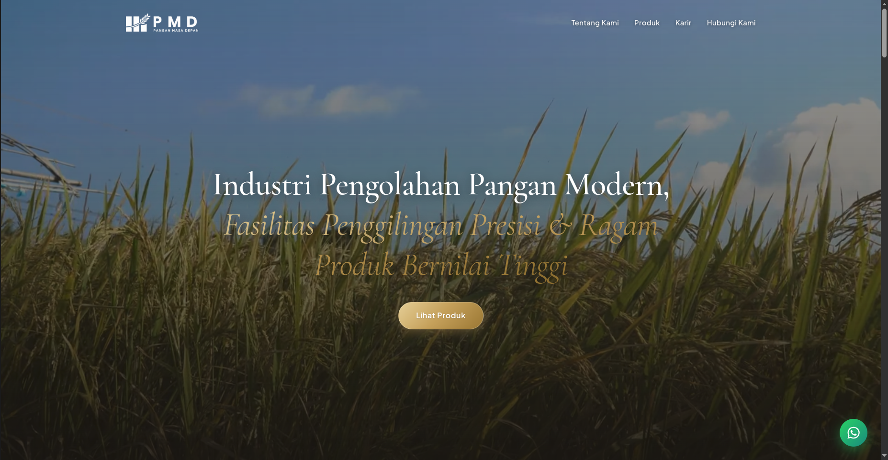
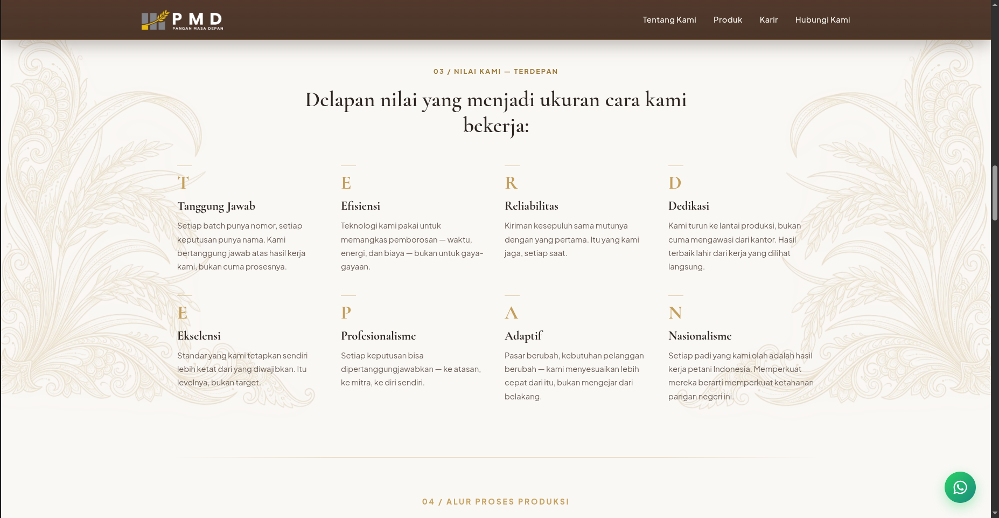
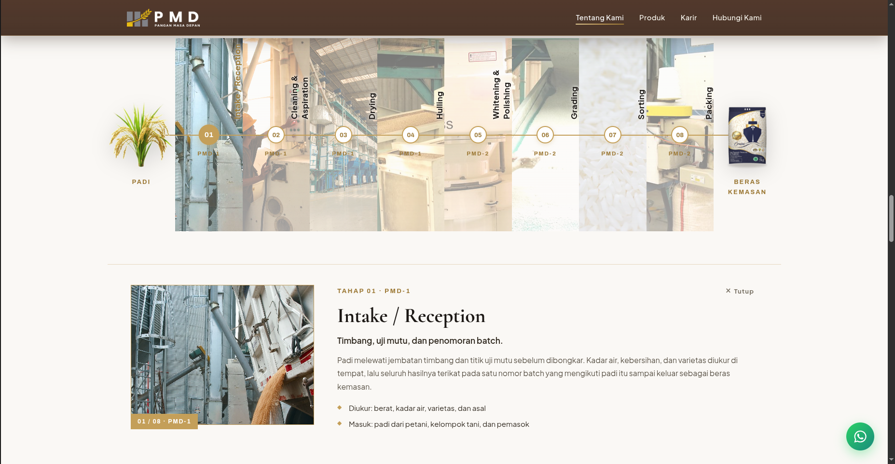
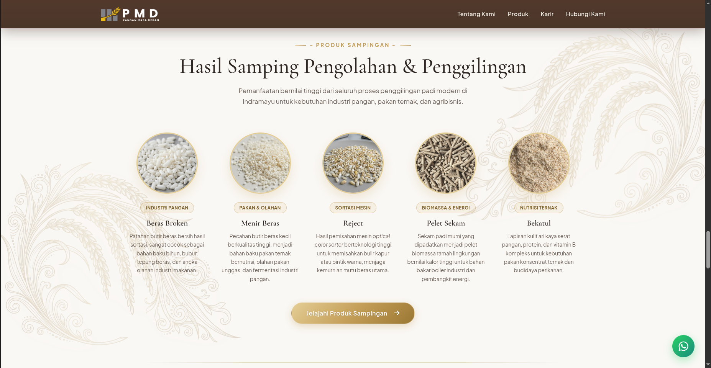
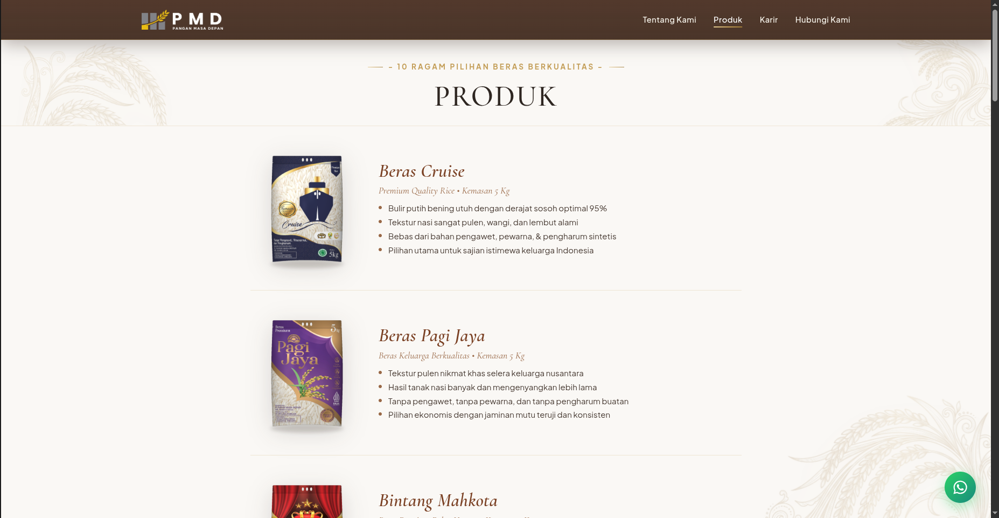
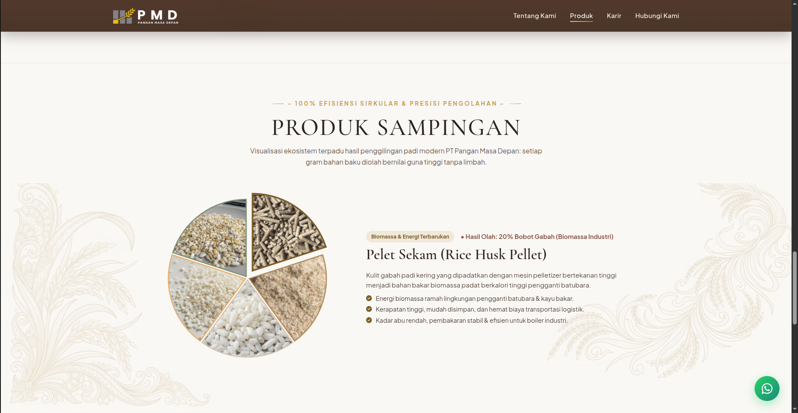
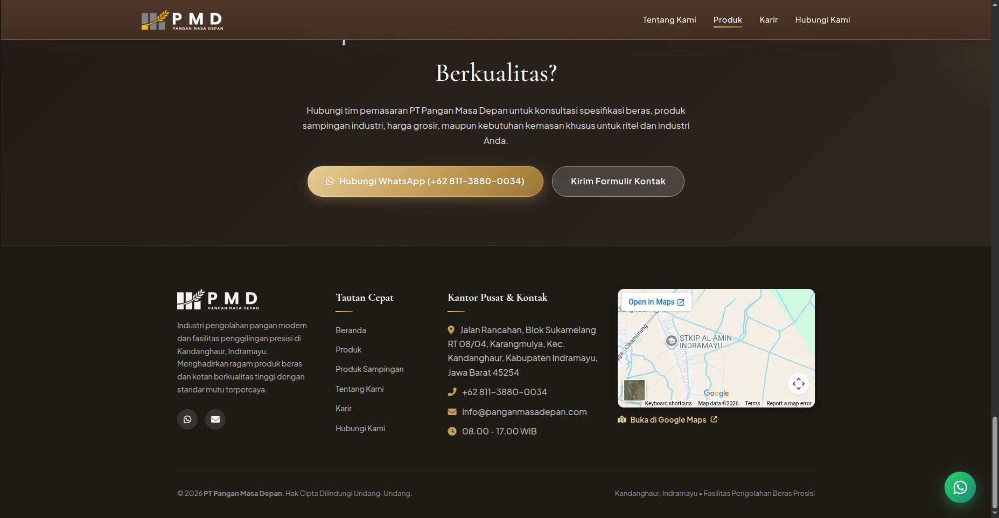

# PT Pangan Masa Depan (PMD) — Website Company Profile

Website company profile untuk **PT Pangan Masa Depan**, industri pengolahan pangan dan penggilingan padi modern di Kandanghaur, Indramayu, Jawa Barat. Website ini memperkenalkan perusahaan, alur produksi, ragam produk beras, produk sampingan, lowongan karir, dan kontak.

> Dibangun sebagai website statis (HTML, CSS, JavaScript) tanpa framework dan tanpa proses build, jadi bisa langsung dibuka di browser atau di-hosting di layanan static hosting mana pun.

---

## Tampilan Website

### 1. Hero (Beranda)



Bagian pembuka beranda. Latar foto hamparan padi dengan lapisan gelap agar teks tetap terbaca. Judul memakai dua gaya huruf: kalimat utama tegak dan kalimat lanjutan miring berwarna emas. Navbar saat ini transparan dan menyatu dengan latar (menu: Tentang Kami, Produk, Karir, Hubungi Kami). Tombol **Lihat Produk** mengarahkan pengunjung ke katalog. Tombol WhatsApp hijau di pojok kanan bawah selalu tampil di semua halaman.

### 2. Nilai Perusahaan (TERDEPAN)



Delapan nilai perusahaan disusun dari akronim **T-E-R-D-E-P-A-N**: Tanggung Jawab, Efisiensi, Reliabilitas, Dedikasi, Ekselensi, Profesionalisme, Adaptif, dan Nasionalisme. Tiap nilai punya huruf awal berwarna emas, judul, dan penjelasan singkat, ditata dalam grid 4 kolom. Ornamen motif padi di kiri dan kanan jadi identitas visual halaman. Pada titik ini navbar sudah berubah menjadi cokelat solid karena halaman di-scroll.

### 3. Alur Proses Produksi (Interaktif)



Garis waktu dari **Padi** sampai **Beras Kemasan** dengan 8 tahap: Intake/Reception, Cleaning & Aspiration, Drying, Hulling, Whitening & Polishing, Grading, Sorting, dan Packing. Setiap tahap diberi label lini produksi (**PMD-1** untuk tahap 01–04, **PMD-2** untuk tahap 05–08) dan latar foto mesin aslinya. Saat satu tahap diklik, panel detail terbuka di bawahnya berisi foto, ringkasan tahap, penjelasan, dan poin yang diukur (contoh di screenshot: Tahap 01 Intake/Reception, yaitu penimbangan, uji mutu, dan penomoran batch). Tombol **Tutup** menutup panel.

### 4. Produk Sampingan di Beranda



Ringkasan lima hasil samping penggilingan: **Beras Broken**, **Menir Beras**, **Reject**, **Pelet Sekam**, dan **Bekatul**. Masing-masing tampil dengan foto bulat berbingkai emas, label kategori (Industri Pangan, Pakan & Olahan, Sortasi Mesin, Biomassa & Energi, Nutrisi Ternak), dan deskripsi singkat. Tombol **Jelajahi Produk Sampingan** menuju halaman lengkapnya.

### 5. Halaman Produk



Katalog **10 ragam beras berkualitas**. Tiap produk ditampilkan berselang dengan foto kemasan di kiri dan info di kanan: nama, tagline dan ukuran kemasan (contoh: Beras Cruise, Premium Quality Rice, 5 kg; Beras Pagi Jaya, Beras Keluarga Berkualitas, 5 kg), lalu empat poin keunggulan. Garis pemisah tipis memisahkan antarproduk.

### 6. Halaman Produk Sampingan



Halaman detail dengan konsep **efisiensi sirkular**. Diagram lingkaran berisi foto kelima hasil samping, dan di sampingnya ada penjelasan produk yang sedang dipilih. Contoh di screenshot: **Pelet Sekam (Rice Husk Pellet)**, hasil olah sekitar 20% bobot gabah, dengan keunggulan sebagai energi biomassa ramah lingkungan pengganti batubara, kerapatan tinggi sehingga hemat biaya logistik, serta kadar abu rendah untuk boiler industri.

### 7. Ajakan Kontak dan Footer



Bagian penutup berlatar gelap. Ada ajakan konsultasi dengan dua tombol: **Hubungi WhatsApp** dan **Kirim Formulir Kontak**. Footer berisi deskripsi singkat perusahaan, tautan cepat (Beranda, Produk, Produk Sampingan, Tentang Kami, Karir, Hubungi Kami), alamat kantor pusat, telepon, email, jam kerja, serta peta Google Maps tersemat dengan tautan **Buka di Google Maps**.

---

## Fitur dan Halaman

| Halaman | File | Isi |
|---|---|---|
| Beranda | `index.html` | Hero, tentang kami, 8 nilai perusahaan, alur produksi interaktif, ringkasan produk sampingan, CTA kontak |
| Produk | `products.html` | 10 ragam beras berkualitas lengkap dengan kemasan dan keunggulan |
| Produk Sampingan | `byproducts.html` | Beras broken, menir beras, reject, pelet sekam, dan bekatul beserta kegunaannya |
| Karir | `karir.html`, `career.html` | Informasi lowongan dan karir di PMD |

**Fitur utama:**

- Alur produksi interaktif 8 tahap di dua lini (PMD-1 dan PMD-2)
- Katalog produk dengan foto kemasan dan daftar keunggulan
- Visualisasi produk sampingan dalam diagram lingkaran bergambar
- Tombol WhatsApp melayang di semua halaman
- Peta Google Maps lokasi kantor pusat di footer
- Navbar transparan di hero yang berubah solid saat di-scroll
- Desain responsif dengan ornamen motif padi dan palet cokelat–emas

---

## Teknologi

- **HTML5** untuk struktur halaman
- **CSS3** untuk styling, layout, dan animasi
- **JavaScript (vanilla)** untuk interaksi (navbar, alur produksi, dan lain-lain)
- **Google Fonts** untuk tipografi (serif elegan untuk judul, sans-serif untuk teks)
- **Google Maps Embed** untuk peta lokasi

---

## Struktur Folder

```
.
├── index.html          # Beranda
├── products.html       # Katalog beras
├── byproducts.html     # Produk sampingan
├── karir.html          # Halaman karir
├── career.html         # Halaman karir (versi lain)
├── css/                # Stylesheet
├── js/                 # Script interaksi
├── images/             # Foto produk, proses produksi, dan logo
├── assets/             # Aset pendukung (ornamen, ikon, dll.)
├── scripts/            # Script bantu pengembangan
└── docs/screenshots/   # Screenshot untuk dokumentasi README
```

---

## Menjalankan di Lokal

Tidak perlu install dependency. Pilih salah satu:

**1. Buka langsung**

Klik dua kali `index.html`, atau buka lewat browser.

**2. Pakai server lokal (disarankan)**

```bash
# Python
python3 -m http.server 8000

# atau Node.js
npx serve .
```

Lalu buka `http://localhost:8000`.

---

## Deploy

Karena website statis, bisa di-hosting gratis di:

- **GitHub Pages**: Settings → Pages → Source: `main` branch, folder `/ (root)`
- **Netlify** atau **Vercel**: hubungkan repo, tanpa build command, publish directory `.`

---

## Informasi Perusahaan

**PT Pangan Masa Depan**
Jalan Rancahan, Blok Sukamelang RT 08/04, Karangmulya, Kec. Kandanghaur, Kabupaten Indramayu, Jawa Barat 45254

- Telepon / WhatsApp: +62 811-3880-0034
- Email: info@panganmasadepan.com
- Jam kerja: 08.00 – 17.00 WIB

---

## Catatan Pengembangan

- Konten (teks, foto, logo, dan data perusahaan) adalah milik PT Pangan Masa Depan.
- Berkas uji coba seperti `test_*` dan `verify_*` (screenshot dan HTML percobaan) tidak disertakan di repo karena sudah masuk `.gitignore`.

---

## Pengembang

Dikembangkan oleh **Yafi Humam Muzhafar (Humzu)**
GitHub: [@Humzuuu05](https://github.com/Humzuuu05)

---

© 2026 PT Pangan Masa Depan. Hak cipta dilindungi undang-undang.
